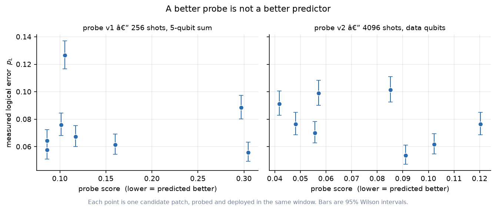
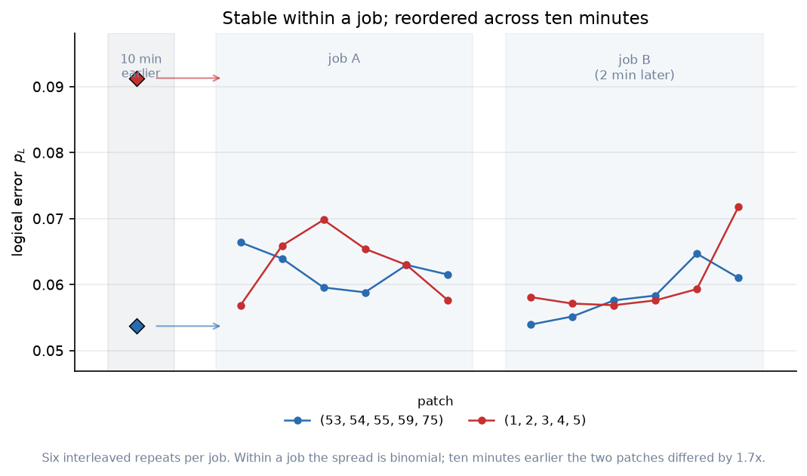
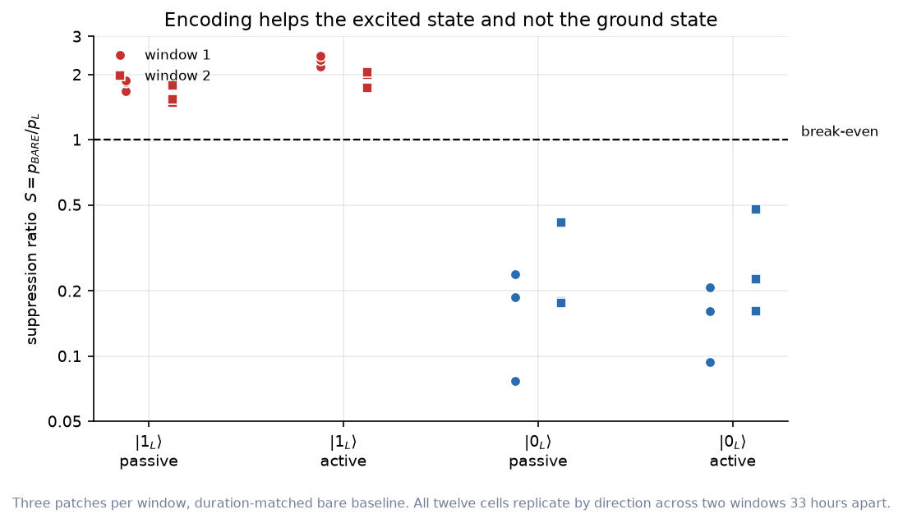
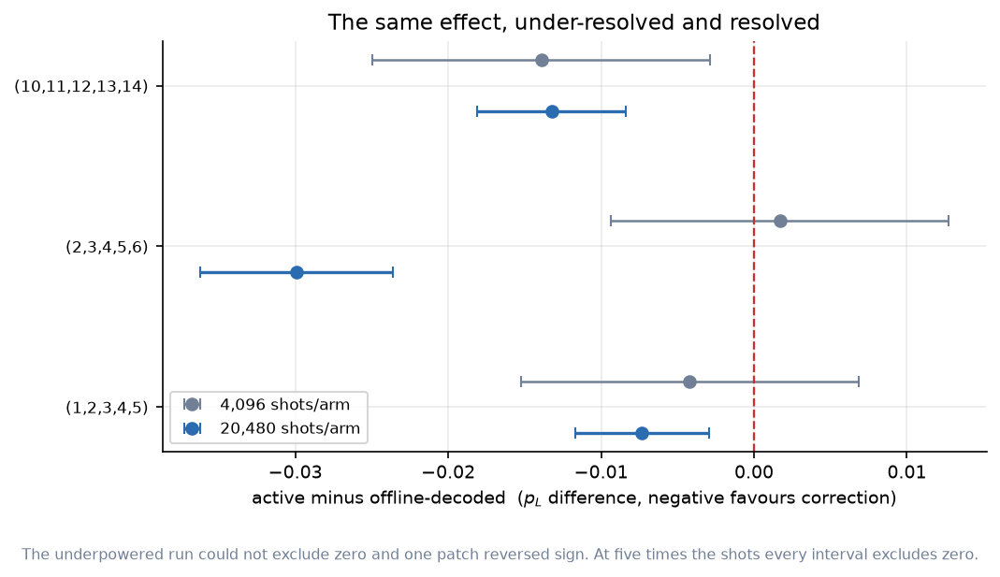

# Five Ways of Predicting Logical Error, and Why None of Them Worked

**A preregistered pilot study of distance-3 repetition-code memory on IBM Heron hardware**

Billy R. Davis Jr. — Hudson Forge Technologies, IRMB program
Independent research, self-funded

---

## Abstract

Published calibration data describes how a quantum processor drifts, and
the natural inference is that it should be actionable: place a circuit on
the qubits the record says are good today. We tested that inference for
quantum error correction on a 156-qubit IBM Heron processor, using a
distance-3 bit-flip repetition code and five distinct instruments — a
longitudinal calibration archive under two independently derived
weightings, a short measured probe at two precisions, and the raw
published calibration itself.

None predicted the logical error rate. Within-session rank correlations
between probe score and measured logical error were −0.072 at 256 probe
shots and −0.335 at 4096 shots with corrected aggregation; improving
probe precision sixteen-fold did not help. Across a maintenance boundary
where a physical change is documented, the published calibration accounts
for roughly 17% of a five-fold regression in encoded error and predicts
the unencoded arm in the wrong direction.

A stability measurement accounts for all five failures at once. Logical
error is binomially stable within a single job but moves roughly 31%
across ten minutes, and the ranking of candidate patches collapses over
the same interval — two patches differing by a factor of 1.7 became
statistically indistinguishable. Every instrument tested compares
information gathered at one moment against performance at another, and
that interval is where the information is lost.

The complementary prediction holds. Comparisons made within a single job
survived: the ratio of encoded to bare error moved 11% between windows in
which the absolute rates moved 25–31%. Those paired comparisons yield two
positive results. Against a duration-matched physical qubit the code
suppresses logical bit-value error for the excited logical state
(S = 1.5–2.4, replicated across two windows) and fails to for the ground
state (S = 0.08–0.48) — an asymmetry that rises monotonically with
exposure time across 9.6, 21.1 and 32.6 µs, as relaxation predicts. And
in-circuit feedforward correction outperforms offline decoding of the
same syndrome records at 20,480 shots per arm, with every interval
excluding zero and the benefit attributable to the correction rather than
to the conditional-control path.

The study is a preregistered pilot conducted on consumer-tier access:
eight amendments, six logged deviations, and 475 QPU-seconds across 26
jobs against a 40-minute cap. No confirmatory superiority claim is made.
Every suppression figure reported is logical bit-value error in a
computational-basis memory; no phase-coherence claim is made or implied.
This is a boundary condition on probe-based selection rather than a
refutation of it — one code distance, one topology, one device — with the
timescale that defeats the method measured rather than assumed.

---

## 1. Introduction

A superconducting quantum processor is not the same machine from one hour
to the next. Qubit lifetimes, gate errors and readout fidelities drift
continuously, and the operators of these devices publish calibration data
precisely so that users can account for it. The natural inference is that
this data should be actionable: if the published record says some qubits
are better than others today, a circuit placed on the better ones should
perform better.

That inference has a literature behind it. Tannu and Qureshi analysed 52
days of IBM characterisation data and proposed variation-aware qubit
allocation; Murali and colleagues used spatial and temporal calibration
variation for noise-adaptive compiler mapping. Both reported meaningful
improvements in circuit fidelity from choosing where to compute. More
recently the same logic has been applied to quantum error correction,
where selection is reported to reduce logical error substantially when
candidate patches are ranked by short measured probes rather than by
published metadata.

Error correction raises the stakes on that inference. A distance-3 code
spends five physical qubits, twenty-eight two-qubit gates and nine
mid-circuit measurements to protect one logical bit. At current error
rates the overhead is comparable to the errors being corrected, so the
question of *where* to place the code is not a marginal optimisation —
it plausibly decides whether the code helps at all.

This study asks the narrow version of that question:

> Does a longitudinal calibration archive, or a short measured probe,
> predict the logical error rate of a distance-3 bit-flip repetition code
> well enough to choose where to place it?

**The constraint shapes the question.** This work was conducted on
consumer-tier access — an open-plan IBM Quantum account with a
promotional allocation, and a Raspberry Pi 5 polling the calibration API
hourly since June 2026. That is not incidental framing. A researcher with
dedicated hardware access can afford to re-measure continuously; a
researcher on an open plan cannot, and must instead rely on information
gathered before the run. Whether that information survives the interval
between gathering and acting is therefore a practical question for anyone
working under the same constraint, and it is not one the existing
literature addresses directly.

The archive itself was built for an earlier study, where calibration
drift emerged as a confound that could not be isolated. Turning that
confound into an instrument — hourly snapshots, deduplicated by
calibration cycle, 707 cycles for one device and 786 for another — made
it possible to ask whether the drift record is good for anything beyond
describing what already happened.

The answer developed here is no, across five distinct instruments, and
the interesting part is the mechanism. Sections 3 and 4 report the
failures and then the stability measurement that accounts for them.
Sections 4.4 through 4.7 report what did work: the comparisons the study
could make *within* a single job, which include a replicated break-even
result and a powered confirmation that in-circuit feedforward correction
outperforms offline decoding.

**What this is not.** No fault-tolerance claim is made. No claim about
phase coherence is made or implied — the code protects a single error
channel, and every suppression figure reported here is logical
*bit-value* error in a computational-basis memory. And this is not a
contradiction of the probe-selection literature. It is one code distance,
one patch topology, one decoder and one device; the differences from
reported successes are named in section 7, and a positive result on other
hardware would bound where this negative applies rather than overturn it.

Total quantum resource consumed: 475 QPU-seconds across 26 jobs, against
a preregistered budget cap of 40 minutes.

## 2. Methods

### 2.1 Preregistration

Staged: a Stage A engineering pilot with an explicit forbidden-analyses
list, then a Stage B confirmatory commit fixing the matrix and the
analysis model. Eight amendments (A1-A8) and six deviations (D-A1, D-A2,
D-B1 through D-B4), each timestamped before the run it governs. The
smallest-effect-of-interest was fixed at 0.010 before any simulation and
never revised. The full document is `PREREGISTRATION.md`.

The study class is **pilot estimation**. No confirmatory superiority
claim is made anywhere, for a reason fixed in advance: the sign-test
arithmetic shows that the session counts this budget supports cannot
support one.

### 2.2 Code and circuits

Distance-3 bit-flip repetition code — three data qubits, two syndrome
ancillas, three syndrome-extraction rounds. Frozen syndrome-to-correction
table, verified exhaustively at 1, 3 and 5 rounds (4, 64 and 1024
histories). Three hardware circuit classes:

- **BARE** — a single physical qubit, duration-matched by an explicit
  delay derived from the scheduled encoded circuit.
- **ENC_PASSIVE** — encoded, syndromes recorded, no in-circuit action;
  decoded offline with the same frozen table.
- **ENC_ACTIVE** — encoded, per-round `if_else` feedforward correction.

Both logical states are prepared and reported separately throughout,
never averaged. Compile verification on the live target confirmed zero
SWAP insertion, preserved conditionals at optimization level 3, and no
flag-qubit requirement: 12 of 12 candidate patches, depth 74, 28
two-qubit gates.

### 2.3 Instrument

The QPU Drift Collector: a Raspberry Pi 5 polling IBM's calibration API
hourly since 2026-06-18, deduplicating on calibration timestamp so each
stored file is a distinct cycle.

### 2.4 Selection policies

- **P-archive** — a frozen rolling score over all prior cycles.
- **P-today** / **P-probe** — the most recent cycle, or a short measured
  probe executed in the same window as deployment.
- **P-generic** — the transpiler's default layout.

### 2.5 Backend

The study began on `ibm_fez` and migrated to `ibm_marrakesh` (Amendment
A4) after `ibm_fez` accumulated 24,668 pending jobs following an 83-hour
fleet-wide calibration freeze; a one-PUB, ten-shot diagnostic job queued
there for five days. The migration was declared before any
`ibm_marrakesh` data was collected. The `ibm_fez` session is retained as
a pilot and is never pooled with `ibm_marrakesh` results.

---

## 3. Simulation

Archive-seeded noisy simulation used held-out evaluation: policies select
using only cycles strictly before a target cycle, then are evaluated on
that cycle's noise model. This was verified directly — corrupting the
held-out snapshot leaves the selections unchanged.

Aer crashed non-deterministically during this sweep (exit -1073741819 /
SIGSEGV), reproducibly on both Windows and Linux, on physically valid
calibration values, with and without dynamic circuits, and with a reused
simulator crashing on its second run where the same condition passed when
run first in a fresh process. The cause is inside Aer and not fixable
from Python. Each condition was therefore executed in its own subprocess;
crashed cells are recorded with exit codes and excluded. Crash rates were
8.8% and 8.6% across the two sweeps (394 and 395 of 432 cells).

**The archive policy was worse out of sample in all six variant/state
combinations, in both sweeps.** Discriminant validity failed: the
deliberately weak patch underperformed the selected patches in only 48%
of comparable cells, where 80% was required.

A feature diagnosis over 131 completed cells identified the mechanism.
Readout error dominates the prediction of logical error (Spearman
+0.83 to +0.91 in every variant/state cell, +0.607 pooled), and all four
instantaneous features point the right way. But the two archive-only
temporal terms are **anti**-predictive: historical variance at -0.114 and
worst-tail at -0.188, negative in every cell. The composite scores split
accordingly — the instantaneous score at +0.282, weak but valid; the
archive score at **-0.114**, worse than random.

Weights were then re-derived directly from those measured correlations,
scale-corrected so each term's contribution tracked its |rho|, with the
anti-predictive penalties set to zero (Amendment A1). **The re-weighted
score did not rescue the policy.** Deltas remained positive in all six
cells and discriminant validity got *worse*, from 48% to 41%.

Two independently derived scoring functions, one intuition-based and one
fitted to measured outcomes, both failed the same gate. That is the first
of the five failures.

---

## 4. Hardware results

### 4.1 The policy comparison is a null with structural variance

Four sessions, three of them discordant (in the fourth, both policies
selected the same patch and the session carries no contrast). The paired
mean difference was **+0.00073 with a standard deviation of 0.0673** —
ninety times the mean, against a smallest-effect-of-interest of 0.010.
Individual sessions gave +0.0859, -0.0786 and -0.0051.

This was not extended, deliberately. The variance is structural rather
than statistical: each session compares a *different pair of patches*, so
"policy" is confounded with "which patch was selected." Roughly 350
sessions would be needed to resolve the effect against that variance, and
they would still not remove the confound.

### 4.2 The probe does not predict logical error

The natural objection to section 3 is that archived metadata is stale by
construction, and that a probe measuring the device *now* would work.

To test it, all eight probed candidates were deployed — not only the two
or three selected — within a single window, giving eight within-session
pairs of probe score and measured logical error with no cross-session
confound.

**Spearman rho = -0.072** (n = 8). The patch the probe ranked *worst*
recorded the *lowest* measured logical error of all eight.

Probe precision was then examined and found inadequate by arithmetic
independent of any correlation: at 256 shots, a per-qubit readout
measurement of p = 0.01 carries a standard error of 62% of the value, and
the ten-measurement composite roughly 20% on a sum near 0.10 —
comparable to the between-patch spread it must resolve.

A redesigned probe was declared in advance (Amendment A6) with two
changes: 4096 shots rather than 256, dropping the standard error to 16%,
and aggregation over the three data qubits only, since ancilla readout
had shown no relation to the outcome. The decision rule was frozen, and
the failure branch was named as the stronger scientific claim.

**Spearman rho = -0.335.** All four measures ran in the anti-predictive
direction: the redesigned score at -0.335, the original recomputed at
-0.347, syndrome detection alone at -0.287, ancilla readout alone at
-0.359.

A sixteen-fold improvement in precision and a corrected aggregation did
not help. The failure is structural, not a probe-design artifact.

*Figure 1. Probe score against measured logical error, for all eight
candidates probed and deployed in the same window. Left: the deployed
probe at 256 shots. Right: the redesigned probe at 4096 shots with
data-qubit-only aggregation. Bars are 95% Wilson intervals. Neither
shows a usable relationship.*

### 4.3 Why: the target moves faster than the measurement

Two patches were deployed six times each, interleaved, within one job,
and the job was then repeated.

**Within a job, logical error is binomially stable.** Three of four
patch-job cells were consistent with binomial sampling (chi-square
p = 0.73, 0.12, 0.33); the fourth was marginal at p = 0.034 and does not
survive correction for four tests. Two jobs two minutes apart differed by
-6.0% and -4.7%, both in the same direction — a global shift rather than
patch-specific reordering.

**Across ten minutes, it is not.** The same patch, same circuit, measured
ten minutes earlier in the probe-v2 deployment, gave a logical error rate
of 0.0913 with a 95% interval of [0.0829, 0.1005]. In the stability job it
gave 0.0631, with the six repeats spanning 0.0569 to 0.0698. **The
intervals do not overlap.** Over the same interval, two patches that had
differed by a factor of 1.7 became statistically indistinguishable.

Selection compares measurements separated in time. Probe and deployment
are separate job submissions with queue time between them. If the ranking
reorders on a ten-minute scale, the probe describes a device state that
has already moved.

This is a common cause for all the failures above, and it is testable
rather than merely plausible.

*Figure 2. Two patches, six interleaved repeats per job, two jobs two
minutes apart. Diamonds at left are the same two patches measured ten
minutes earlier, where they differed by a factor of 1.7. Within a job
the spread is binomial; across ten minutes the ordering collapses.* The complementary prediction — that
comparisons made *within* a job should survive — is confirmed in section
4.4.

### 4.4 Break-even, and the state asymmetry

An initial break-even result was void: the bare arm had been executed
without its duration-matching delay, comparing an instantaneous
measurement against a three-round encoded circuit (deviation D-B3). The
error was found at analysis, before any break-even figure was reported,
and corrected by supplementary runs.

Deriving the match required care. Qiskit cannot schedule circuits
containing control flow, so `ENC_PASSIVE` was scheduled instead — identical
encoding, rounds and readout, lacking only the conditional branches. The
resulting delay of 5272 dt (21.09 µs) was cross-checked by hand against
target instruction durations, agreeing within 3.1%. The residual
mismatch biases *against* the encoded arm.

Two windows, 33 hours apart, on three patches:

| | window 1 | window 2 |
|---|---|---|
| \|1_L⟩ ENC_PASSIVE | S = 1.68, 1.84, 1.88 | S = 1.49, 1.53, 1.78 |
| \|1_L⟩ ENC_ACTIVE | S = 2.18, 2.35, 2.44 | S = 1.99, 1.74, 2.05 |
| \|0_L⟩ ENC_PASSIVE | S = 0.24, 0.08, 0.19 | S = 0.18, 0.18, 0.42 |
| \|0_L⟩ ENC_ACTIVE | S = 0.21, 0.09, 0.16 | S = 0.23, 0.16, 0.48 |

**All twelve cells replicate by direction.** The code suppresses logical
bit-value error for the excited state and fails to for the ground state.

Baseline convention matters and both are reported: against the *best
measured* constituent qubit rather than the mean of three, the excited-state
figures fall to 1.11-1.33 (passive) and 1.44-1.69 (active) — still above
one, considerably less dramatic.

**The ratio survived drift that the absolute rates did not.** Between the
two windows, bare error moved 30.6% on average and encoded error 25.2%,
while the ratio S moved only **11.1%**. The two arms drift together, and
the within-job pairing cancels most of it. That is the direct complement
of section 4.3: comparisons separated in time lose information;
comparisons made inside one job retain it.

*Figure 3. Suppression ratio against a duration-matched physical qubit,
three patches per window, two windows 33 hours apart. All twelve cells
replicate by direction: above break-even for the excited state, well
below it for the ground state.*

### 4.5 The asymmetry is dose-dependent in exposure

If the excited-state advantage arises because a bare |1⟩ relaxes toward
|0⟩ over the matched idle while a bare |0⟩ does not, the effect should
scale with exposure time. This was declared in advance, with the
prediction stated on the *state asymmetry* S(|1_L⟩) − S(|0_L⟩) and
explicitly no prediction on S alone.

One patch, three round counts, exposures of 9.57, 21.09 and 32.61 µs, all
in a single job:

| arm | 9.57 µs | 21.09 µs | 32.61 µs | change |
|---|---|---|---|---|
| BARE \|0_L⟩ | 0.0127 | 0.0129 | 0.0117 | **−8%** |
| BARE \|1_L⟩ | 0.0888 | 0.1510 | 0.2073 | **+133%** |
| ENC \|1_L⟩ | 0.3184 | 0.3530 | 0.3948 | +24% |

The state asymmetry rose monotonically — +0.224, +0.368, +0.469 for the
passive arm and +0.231, +0.349, +0.440 for the active arm, Spearman
+1.00 in both. A bare excited state degrades with exposure; a bare ground
state does not move; and the encoded excited state degrades a fifth as
fast as the bare one. The code suppresses the relaxation channel, and the
suppression scales with dose.

**This window's absolute values are not comparable to section 4.4's.**
The job executed immediately after a maintenance window, under a
recalibrated device on which every S fell below one. Deviation D-B4
documents this; section 4.6 examines it, because the discrepancy turns
out to be a result rather than a caveat.

### 4.6 Published calibration mispredicts a known device change

Between the break-even windows and the exposure sweep, `ibm_marrakesh`
underwent maintenance and recalibrated. On the same patch, at the same
round count, the encoded error rose roughly five-fold (0.0798 to 0.3530)
while the bare arm stayed comparable (0.1339 to 0.1510). Bare circuits use
only a delay and a terminal measurement; encoded circuits add 28
two-qubit gates, 9 mid-circuit measurements and 6 resets. The change acted
on the encoded path.

The published calibration explains part of it and mispredicts the rest.

**CZ error rose sharply** — summed over the four data-ancilla couplers,
+89% (individual edges +51%, +14%, +66%, +170%), with ancilla readout
essentially unchanged. But twenty-eight two-qubit gates times the mean
increase gives an accumulated +0.0477 against a measured increase of
+0.2732: approximately **17%**. The remainder involves mid-circuit
measurement error and ancilla reset fidelity, neither of which appears in
published calibration data.

**And it predicts the bare arm backwards.** T1 improved on every data
qubit (96.8 to 209.0, 214.1 to 286.6, 210.9 to 288.4 µs). Relaxation over
the matched 21.09 µs exposure should have fallen from 0.196 to 0.096 on
the first data qubit. The measured bare excited-state error instead rose
slightly.

This is the fifth instrument, and the strongest case. The first four
concerned *ranking patches against each other*. This one concerns *a
single patch across time*, where a physical change is known to have
occurred and its magnitude is documented in the calibration record. The
metadata still does not describe what the circuits experience.

### 4.7 Feedforward correction works, and the benefit is attributable

Sessions 11-14 showed in-circuit correction outperforming offline
decoding of the same syndrome records in 12 of 12 cells. A first
attribution attempt at 4096 shots per arm failed to replicate it (net
effect −0.0042, +0.0017, −0.0139, with every interval overlapping) and was
briefly taken as a reversal. It was underpowered by roughly five-fold:
resolving a 0.005 difference at p ≈ 0.07 requires about 20,000 shots per
arm.

Re-run at 20,480 shots per arm, with three arms interleaved in one job:

| patch | net effect | 95% interval |
|---|---|---|
| (1,2,3,4,5) | −0.0073 | [−0.0117, −0.0030] |
| (2,3,4,5,6) | −0.0299 | [−0.0362, −0.0236] |
| (10,11,12,13,14) | −0.0132 | [−0.0181, −0.0084] |

All three exclude zero. The decomposition attributes it: the correction
benefit excludes zero and is negative in all three patches (−0.0066,
−0.0389, −0.0133), while the control-path cost — measured by a diagnostic
circuit carrying the identical measure-and-branch structure with a
conditional gate on an already-reset ancilla — includes zero in two of
three. **The advantage comes from correcting errors, not from traversing
the conditional path.**

A post-hoc observation, untested: the effect scaled with baseline error
across the three patches (relative effects −12.8%, −17.7%, −22.0%).

*Figure 4. The same comparison at two resolutions. At 4,096 shots per
arm no interval excludes zero and one patch reverses sign; at 20,480
every interval excludes zero. The effect was always there — the first
test could not see it.*

---

### 4.8 A pre-declared question that lost its premise

Amendment A2 declared a third question alongside the policy comparison and
the break-even characterisation: an independent point estimate of the
crossover threshold at which measured-probe selection begins to help,
reported in prior work as a baseline logical error rate of 0.112 and
flagged there as derived post-hoc from the dataset that demonstrated the
effect.

Regressing the probe-minus-generic difference in logical error on the
generic baseline across four sessions gives a slope of -0.297 and an
x-intercept of **0.0667**, with a bootstrap 95% interval of
[-0.0003, 0.0869]. The direction is consistent with that work - the
probe's relative advantage grows as baseline error rises - at a lower
threshold than reported.

**That estimate should not be used, and is reported here only because it
was declared in advance.** It presumes that the probe carries information
about which patch will perform better; section 4.2 establishes that it
does not, at either precision tested. A crossover in the benefit of a
selection method cannot be estimated when the method has no discriminant
validity on the device in question. At four sessions the interval also
includes zero.

Amendment A6 stated this consequence before the probe-validity test was
run: a pass would not have reinstated this question, and a failure would
remove its premise. The failure occurred. The question is therefore
reported and withdrawn rather than quietly omitted.

## 5. Discussion

### 5.1 One failure, not five

Five instruments were tried: a calibration-archive score under two
independently derived weightings, a measured probe at two precisions, and
the raw published calibration across a known device change. It would be
possible to explain each failure separately — the archive is stale, the
probe is noisy, the calibration omits mid-circuit measurement quality.
Each of those explanations is partly true.

But they share a structure. Every one of these instruments compares
information gathered at one moment against performance at another. The
archive's gap is hours to days; the probe's is minutes, since probe and
deployment are separate job submissions with queue time between them; the
calibration's, across the maintenance boundary in section 4.6, was days.

Section 4.3 measured what happens across that gap. Logical error is
binomially stable within a single job and moves roughly 31% across ten
minutes, with the ordering of candidate patches collapsing over the same
interval. Two patches that differed by a factor of 1.7 became
statistically indistinguishable.

If the ranking reorders faster than the measure-then-act cycle, no
instrument that respects that cycle can succeed, regardless of how well
it is built. Improving the probe sixteen-fold in precision did not help,
and would not be expected to.

### 5.2 The complementary evidence

A negative result of this kind is only as strong as its control. If the
device were simply too noisy to measure anything, the study would have
produced nothing but nulls.

It did not. Every comparison made *inside* a single job held up:

- The ratio of encoded to bare error moved 11% between windows in which
  the absolute rates moved 25-31%. The two arms drift together, and
  pairing them within a job cancels most of it.
- The state asymmetry scaled monotonically with exposure time across
  three round counts in one job, exactly as relaxation predicts.
- The feedforward benefit resolved cleanly at 20,480 shots per arm, with
  the correction and the control path separated.

The information is not absent from the device. It is absent from the
interval between measuring and acting.

### 5.3 What this does and does not say about selection

This is a boundary condition, not a refutation. Reported successes in
probe-based selection use larger code distances, longer chains, different
decoders and different devices. Any of those differences could matter,
and section 7 names them.

What this study adds is a case where the method fails, with the timescale
that defeats it measured rather than assumed. That is more useful than
another positive result would have been, because a positive result
establishes that selection *can* work somewhere, while a mechanism
establishes *where it cannot*.

The practical reading for anyone working under similar constraints: if
your measure-to-execute latency exceeds the device's reordering
timescale, selection is not the lever. Budget the shots into the
measurement you actually care about instead.

### 5.4 The instrument that was not tried

If prior measurement cannot track the device, one option remains:
measurement from inside the running computation.

A repetition code already generates a stream of syndrome data at every
round. That stream is produced by the same physical qubits, at the same
moment, under the same conditions as the computation it protects — it has
no measure-to-act gap at all. Existing work has shown that drifting noise
parameters can be recovered from syndrome statistics.

This study has an unusual position from which to extend that: an
independent external telemetry stream, collected hourly for months, that
can be compared against the internal syndrome record. Whether the two
agree, and which leads the other, is a question neither stream can answer
alone. That is where this program goes next.

### 5.5 A note on what the negative cost

The study consumed 475 QPU-seconds. The five failures cost a small
fraction of that; most of the budget went to the confirmatory work in
sections 4.4 through 4.7, and to re-running an underpowered test properly
after its null was briefly mistaken for a reversal.

That ratio is worth recording. Under a constrained budget, the temptation
is to spend everything on the primary question and report whatever comes
back. The gates that killed the primary question here — a probe-validity
test that could fail, and did, twice — cost 54 QPU-seconds between them.
They are the reason the rest of the study is interpretable.

## 6. Limitations

- **Pilot estimation class.** No confirmatory superiority claim is made
  anywhere in this study.
- **Q-A' rests on three discordant sessions**, with variance far exceeding
  any plausible effect.
- **All confirmatory sessions ran under one frozen calibration cycle**, so
  the pre-declared fresh-versus-stale sensitivity analysis is not
  evaluable.
- **The stability test covers two patches**, not the stability of the
  *ranking* across eight, which is what selection actually depends on. It
  bounds a timescale; it does not characterise the process.
- **The ten-minute comparison in section 4.3 was not pre-declared.** The
  amendment's own two-minute arm showed only ~5%; the decisive evidence
  came from a cross-experiment comparison found afterwards.
- **Single device for the reported results.** The `ibm_fez` session is a
  pilot and is not pooled.
- **ENC_ACTIVE is under-matched against BARE** by the unschedulable
  feedforward-branch time, biasing against the encoded arm.
- **Every suppression figure is logical bit-value error** in a
  computational-basis memory. No phase-coherence claim is made or implied.
- **Section 4.5's absolute values** come from a post-maintenance device
  state and are not comparable to section 4.4's.

---

## 7. Related work

Tannu & Qureshi (ASPLOS 2019), variation-aware qubit allocation from 52
days of calibration data. Murali et al. (ASPLOS 2019), noise-adaptive
compiler mappings. Stein et al. (arXiv:2601.16123), calibration-conditioned
FiLM decoders on IBM repetition codes, >2.7M shots, distances to 11.
Bhardwaj, Takou, Lin & Brown (arXiv:2511.09491), sliding-window estimation
of drifting Pauli noise from syndrome statistics. Ashuraliyev,
DAQEC-Benchmark (Zenodo 10.5281/zenodo.18045662) and the noise-level
moderation preprint (Research Square rs-8475008). Wootton
(arXiv:2207.00553), syndrome-derived device benchmarking.

No novelty is claimed over any of these.

**Source caveats.** rs-8475008 is an unrefereed preprint, single-author,
with a threshold its own text describes as derived post-hoc from the
dataset that demonstrated the effect, and internally inconsistent reported
sample sizes.

---

## 8. Reproducibility

MIT licensed. All 26 job identifiers, with device, date and role, are in
`runs/README.md`, including three superseded artifacts explicitly marked.
The preregistration and all amendments are in `PREREGISTRATION.md`. The
simulation tiers reproduce without an IBM account.

---

## 9. Errors found and corrected

Recorded because a study that reports only its successes has not reported
its method.

- **D-A1.** A result parser resolved classical registers by attribute
  name on a container that has an attribute of the same name, reading one
  two-bit register instead of four. An injected-error check reported 0.9043
  where the true value was 0.1582. Found in the pilot, corrected by
  re-analysing the same job at no additional cost.
- **D-A2.** A budget-sizing script asserted that 72 minutes fitted inside
  a 40-minute cap. Corrected before use.
- **D-B3.** The bare arm was executed without its duration-matching delay
  for four sessions, voiding every break-even figure derived from them.
  Found at analysis, before any such figure was reported.
- **A compile gate** verified patches against the wrong backend after a
  hardcoded device name survived a migration. The run was void and was
  repeated.
- **An attribution test** was run five-fold underpowered, and its null was
  briefly taken as a reversal of an established result. Powering it
  properly restored the original finding.
- **A proposed mechanism** — that relaxation on the data qubits explained
  which patches performed best — was tested and refuted by the same
  analysis that generated it.
- **An exploratory correlation** of +0.619 was flagged at the time as
  indistinguishable from a multiple-comparisons artifact across thirteen
  features at n = 8. A pre-declared test subsequently refuted it.
- **A pre-declared question was initially omitted.** The crossover
  estimate declared in Amendment A2 had lost its premise when the
  probe-validity gate failed, and was left out of the first draft rather
  than reported and withdrawn. An external reviewer's misreading of the
  figures involved is what surfaced the omission. It is now section 4.8.
  A preregistered question requires a reported outcome even when that
  outcome is that the question can no longer be asked.
